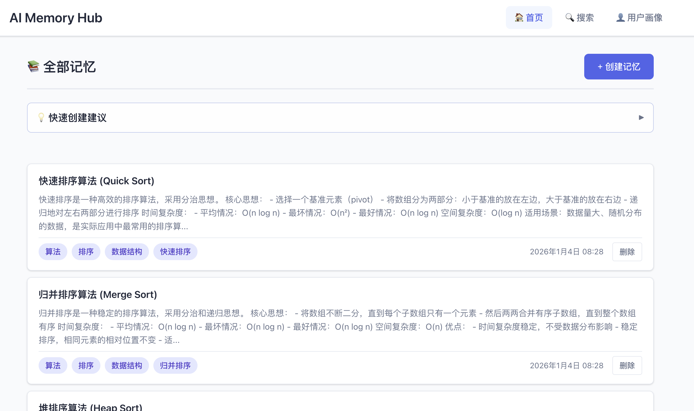
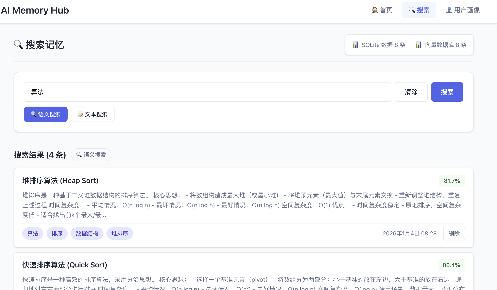

# AI 知识记忆库 (Mymom)

一个为 AI 编辑器用户提供的**本地知识记忆与检索工具**，支持结构化存储、语义搜索和全文检索，解决跨会话、跨编辑器的经验积累和复用问题。

## 项目概述

AI 知识记忆库是一个本地部署的知识管理系统，采用 **SQLite + ChromaDB 双库架构**，具备以下核心特性：

- 🔍 **双模式搜索**：支持语义搜索（向量检索）和全文检索（SQLite FTS）。
- 📝 **结构化存储**：管理标题、内容、标签等结构化信息。
- 📊 **可视化分析**：提供用户画像、标签词云、统计报表。
- 🚀 **多端接入**：支持 Web UI、CLI 命令行，并规划集成 AI 编辑器 Skills。
- 📦 **本地优先**：数据完全存储在本地，确保安全隐私。

---

## 界面预览

### 首页


### 搜索功能


### 用户画像


---

## 安装与使用

项目已发布至 TestPyPI，您可以轻松安装并开始使用。

### 1. 安装

确保您的 Python 版本为 3.11 或更高。

```bash
# 从 TestPyPI 安装
pip install -i https://test.pypi.org/simple/ mymom
```

### 2. 启动服务

安装完成后，可以直接使用 `mymom` 命令：

```bash
# 前台启动
mymom start

# 后台启动
mymom start --bg
```

启动后，访问浏览器：[http://127.0.0.1:7937](http://127.0.0.1:7937)


### 3. 常用命令

```bash
# 查看服务状态
mymom status

# 停止服务
mymom stop
```

---

## AI 编辑器集成

Mymom 支持通过 Skills 方式集成到 AI 编辑器中，让 AI 助手能够直接调用知识库功能。

### Claude Code 集成

将 `skills/myMom` 目录复制到 Claude Code 的根目录下的 `skills` 文件夹中：

```bash
# 假设 Claude Code 项目根目录为 /path/to/your/project
cp -r skills/myMom /path/to/your/project/.claude/skills/myMom
```

复制完成后，Claude Code 会自动识别该技能。

**重要提示**：技能只有在您明确提到 **"本地知识库"** 关键词时才会触发。请在对话中使用以下格式：

- ✅ **搜索记忆**："搜索本地知识库中关于 Python 的记忆"、"在本地知识库中查找包含'AI'的内容"
- ✅ **添加记忆**："将这个 Python 基础知识添加到本地知识库中"、"保存这条信息到本地知识库"
- ✅ **查看记忆**："查看本地知识库中所有标签为'技术'的内容"、"列出本地知识库中的记忆"

⚠️ **注意**：如果只提到"知识库"而没有"本地知识库"，技能可能不会被触发。

### Cursor 集成

如果您想在 Cursor 中使用 Mymom 的知识库功能，可以借助 **OpenSkills** 工具。

**安装 OpenSkills**：
```bash
npm i -g openskills
```

**使用步骤**：
1. 在项目根目录执行 `openskills sync` 同步技能到 `AGENTS.md`
2. Cursor 会自动读取 `AGENTS.md` 中的技能列表
3. 当需要调用知识库时，Cursor 会通过 `openskills read query-knowledge-base` 加载技能

**详细说明**：请参考 [OpenSkills 使用文档](redeme/OPEN_SKILLS.md)

---

## 详细参考文档

如果您需要了解更多关于项目实现、架构或详细配置的信息，请参阅以下文档：

- 📖 **[实现思路与架构设计](redeme/ARCHITECTURE.md)**：深入了解双库架构、搜索策略及数据流向。
- 🛠️ **[项目详细说明](redeme/PROJECT_DETAILS.md)**：包含技术栈、项目结构、API 接口及详细配置指南。
- 📦 **[打包与发布指南](redeme/PACKAGE.md)**：了解如何本地构建和发布到 PyPI。

---

## 注意事项

1. **首次运行**：会自动创建数据目录并下载 Embedding 模型（约 100MB），请保持网络畅通。
2. **数据安全**：所有数据均存储在本地，不会上传到云端。
3. **环境识别**：
   - 开发环境：数据存储在 `./data/`
   - 用户环境：数据存储在 `~/.mymom/data/`
4. **端口占用**：默认端口 7937，可通过环境变量 `MYMOM_PORT` 自定义。

## 许可证

MIT License
