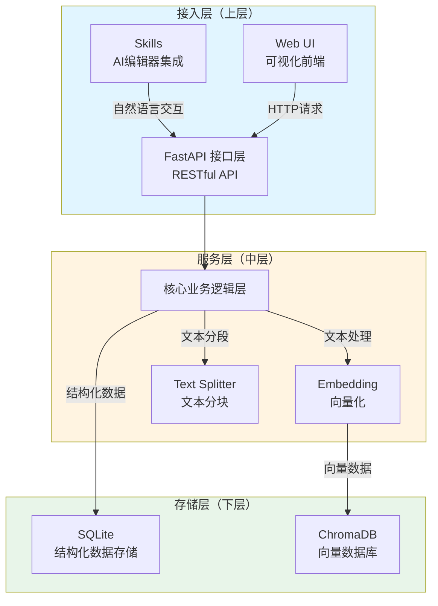
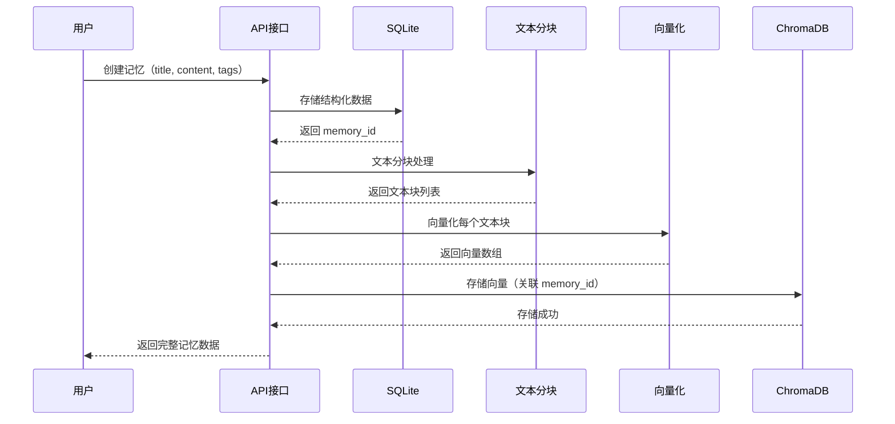
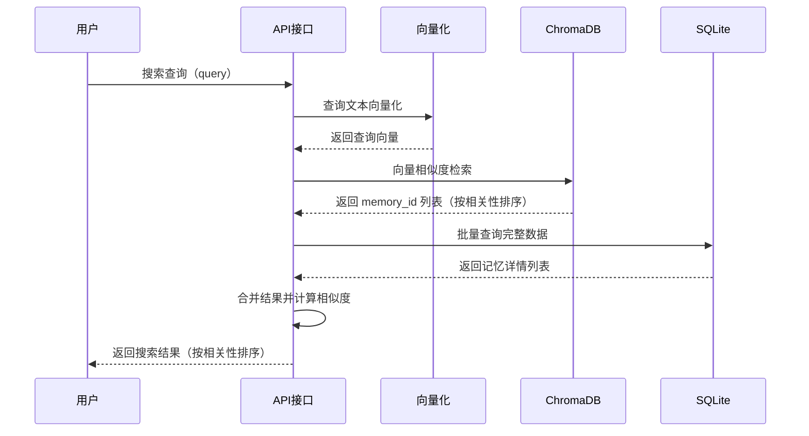

# AI 知识记忆库

一个为 AI 编辑器用户提供的**本地知识记忆与检索工具**，支持结构化存储、语义搜索和全文检索，解决跨会话、跨编辑器的经验积累和复用问题。

## 项目概述

AI 知识记忆库是一个本地部署的知识管理系统，采用 **SQLite + ChromaDB 双库架构**，支持：

- 📝 **结构化知识存储**：标题、内容、标签、时间戳
- 🔍 **语义搜索**：基于向量相似度的智能检索
- 📄 **全文检索**：SQLite 全文搜索（FTS）
- 🏷️ **标签管理**：多标签分类与过滤
- 🌐 **Web UI**：可视化记忆管理与搜索界面
- 💡 **快速创建**：随机建议辅助快速录入
- 📊 **用户画像**：标签统计可视化（云图、饼图、柱状图）
- 🚀 **CLI 工具**：命令行界面，支持后台运行
- 📦 **打包安装**：支持 pip 安装，一键部署

## 项目架构

本项目采用**三层架构设计**，清晰分离接入层、服务层和存储层，实现模块化和可扩展性。

### 架构层次



**架构图说明**：
- 🔵 **接入层**：提供多种接入方式，Skills 和 Web UI 并行
- 🟡 **服务层**：统一 API 接口，核心逻辑处理
- 🟢 **存储层**：双库存储，各司其职

### 架构说明

#### 1. 接入层（上层）

**Skills（AI 编辑器集成）**
- 通过 Cursor Skills 或 Claude MCP 协议集成到 AI 编辑器
- 支持自然语言交互，AI 可自动调用知识库功能
- 实现跨会话、跨编辑器的知识复用

**Web UI（可视化前端）**
- React + JavaScript (JSX) 构建的现代化 Web 界面
- 提供记忆创建、编辑、删除、搜索等完整功能
- 支持语义搜索和全文检索两种模式切换
- 用户画像可视化（标签云图、饼图、柱状图）
- 前端构建产物集成到后端，支持单端口访问

#### 2. 服务层（中层）

**FastAPI 接口层**
- 提供 RESTful API，统一对外接口
- 处理请求验证、错误处理、CORS 配置
- 支持 Swagger 自动文档生成

**核心业务逻辑层**
- **Embedding 模块**：文本向量化，使用 BAAI/bge-small-zh-v1.5 模型
- **Text Splitter 模块**：文本分块处理（chunk_size=1000, overlap=100）
- **业务逻辑封装**：协调双库操作，保证数据一致性

#### 3. 存储层（下层）

**SQLite 数据库**
- 存储结构化数据：id、title、content、tags、created_at
- 支持全文检索（FTS），快速关键词匹配
- 轻量级、零配置、本地存储

**ChromaDB 向量数据库**
- 存储文本向量数据，支持语义搜索
- 使用余弦相似度计算，返回相关性排序结果
- 持久化存储，支持增量更新

### 数据流向

**存储流程**：



**搜索流程**：



### 架构优势

- ✅ **职责清晰**：三层架构，各司其职
- ✅ **双库互补**：SQLite 提供结构化查询，ChromaDB 提供语义搜索
- ✅ **易于扩展**：接口层统一，便于添加新的接入方式
- ✅ **本地优先**：所有数据存储在本地，保护隐私

## 技术栈

### 后端
- **语言**: Python 3.11+
- **框架**: FastAPI 0.109+
- **数据库**:
  - SQLite（结构化数据存储）
  - ChromaDB（向量数据库）
- **向量化**: sentence-transformers (BAAI/bge-small-zh-v1.5)
- **文本处理**: 文本分块（chunk_size=1000, overlap=100）

### 前端
- **框架**: React 18 + JavaScript (JSX)
- **构建工具**: Vite 5
- **样式**: 原生 CSS（无 UI 框架）
- **可视化**: @visactor/vchart（标签统计图表）

## 项目结构

```
Mymom/
├── backend/                    # 后端服务
│   ├── main.py                 # FastAPI 入口
│   ├── config.py               # 配置管理
│   ├── api/                    # API 路由层
│   │   ├── memories.py         # 记忆存储接口
│   │   ├── search.py           # 搜索接口
│   │   └── models.py           # Pydantic 数据模型
│   ├── core/                   # 核心功能层
│   │   ├── chroma_db.py        # ChromaDB 封装
│   │   ├── sqlite_db.py        # SQLite 封装
│   │   └── embedding.py        # Embedding 向量化
│   ├── utils/                  # 工具函数
│   │   └── text_splitter.py    # 文本分段处理
│   └── data/                   # 数据存储目录（自动创建）
│       ├── chroma/             # ChromaDB 数据
│       └── memories.db         # SQLite 数据库
├── frontend/                   # React 前端
│   ├── src/
│   │   ├── api/                # API 调用封装
│   │   ├── components/         # React 组件
│   │   │   ├── Layout.jsx      # 布局组件
│   │   │   ├── MemoryList.jsx  # 记忆列表
│   │   │   ├── MemoryCard.jsx  # 记忆卡片
│   │   │   ├── MemoryForm.jsx  # 创建/编辑表单
│   │   │   ├── MemoryDetail.jsx # 记忆详情
│   │   │   ├── SearchBar.jsx   # 搜索栏
│   │   │   ├── SearchResults.jsx # 搜索结果
│   │   │   └── SuggestionCard.jsx # 建议卡片
│   │   ├── utils/              # 工具函数
│   │   ├── App.jsx             # 主应用组件
│   │   └── main.jsx            # 入口文件
│   ├── package.json
│   └── vite.config.js
├── scripts/                    # 工具脚本
│   ├── run_dev.py              # 一键启动开发服务器
│   ├── build_dist.py           # 构建前端并集成到后端
│   ├── build_package.py        # 一键打包脚本
│   ├── store_data.py           # 数据存储测试
│   ├── search_sqlite.py        # SQLite 搜索测试
│   └── search_vector.py        # 向量搜索测试
├── docu/                       # 项目文档
├── dist/                       # 打包产物（构建后生成）
├── pyproject.toml              # Python 项目配置
├── requirements.txt            # Python 依赖
├── INSTALL.md                  # 安装指南
├── PACKAGE.md                  # 打包指南
└── README.md                   # 项目说明
```

## 核心功能

### 1. 记忆管理
- ✅ 创建记忆（标题、内容、标签）
- ✅ 查看记忆列表（按时间倒序）
- ✅ 查看记忆详情（Dialog 弹窗）
- ✅ 编辑记忆
- ✅ 删除记忆（同步删除 SQLite 和 ChromaDB 数据）
- ✅ 统计信息（SQLite/ChromaDB 数据量）

### 2. 搜索功能
- ✅ **语义搜索**：基于向量相似度，支持自然语言查询
  - 使用 ChromaDB 向量检索
  - 阈值过滤（relevance >= 0.7）
  - 间隔分析（智能分割，保留相关性高的结果）
- ✅ **全文检索**：SQLite FTS，支持关键词匹配
- ✅ 搜索结果按相关性排序
- ✅ 显示相似度分数
- ✅ 支持切换搜索模式（前端 UI）

### 3. 数据存储
- ✅ **SQLite**：存储结构化数据（id, title, content, tags, created_at）
- ✅ **ChromaDB**：存储向量数据，支持语义检索
- ✅ 文本自动分块（chunk_size=1000, overlap=100）
- ✅ 双库同步删除
- ✅ 智能路径选择（开发/用户环境自动识别）

### 4. Web 界面
- ✅ 记忆列表展示
- ✅ 创建/编辑表单
- ✅ 搜索界面（支持切换搜索模式：语义搜索/全文检索）
- ✅ 快速创建建议（随机生成，可折叠）
- ✅ 用户画像页面（标签云图、饼图、柱状图）
- ✅ 统计信息显示
- ✅ 前端构建产物集成到后端（单端口访问）

### 5. CLI 工具
- ✅ `mymom start` - 前台启动服务
- ✅ `mymom start --bg` - 后台启动服务
- ✅ `mymom status` - 检查服务状态
- ✅ `mymom stop` - 停止服务

## 快速开始

详细的安装、打包和启动说明请参考 [PACKAGE.md](PACKAGE.md)。

## API 接口

### 记忆管理

- `POST /api/v1/memories/` - 创建记忆
- `GET /api/v1/memories/` - 获取所有记忆列表
- `GET /api/v1/memories/{memory_id}` - 获取记忆详情
- `DELETE /api/v1/memories/{memory_id}` - 删除记忆
- `GET /api/v1/memories/stats` - 获取统计信息

### 搜索

- `POST /api/v1/search/` - 语义搜索（向量检索）
- `POST /api/v1/search/sqlite` - 全文检索（SQLite FTS）

### 健康检查

- `GET /health` - 服务健康检查

## 搜索策略

### 语义搜索流程

1. 查询文本向量化（使用 BAAI/bge-small-zh-v1.5）
2. ChromaDB 向量检索（top_k=10）
3. 去重处理（同一记忆的多个块只保留相关性最高的）
4. 从 SQLite 批量获取完整数据
5. 计算相似度（distance 转换为 relevance，归一化到 [0, 1]）
6. 阈值过滤（relevance >= 0.7）
7. 间隔分析（找到相关性明显下降的临界点，智能分割）
8. 按相关性排序返回

### 全文检索流程

1. SQLite FTS 关键词匹配
2. 返回匹配的记忆列表
3. 默认 relevance=1.0（关键字匹配）

## 开发说明

### 数据存储位置

数据存储位置根据运行环境自动选择：

- **开发环境**（项目目录存在 `.git`）：`./data/`
  - SQLite 数据库：`./data/memories.db`
  - ChromaDB 数据：`./data/chroma/`
- **用户环境**：`~/.mymom/data/`
  - SQLite 数据库：`~/.mymom/data/memories.db`
  - ChromaDB 数据：`~/.mymom/data/chroma/`
- **自定义位置**：通过环境变量 `MYMOM_DATA_PATH` 指定

### 配置说明

配置文件：`backend/config.py`

主要配置项：
- `embedding_model`: 向量化模型（默认：BAAI/bge-small-zh-v1.5）
- `port`: 后端服务端口（默认：7937）
- `host`: 服务主机（默认：127.0.0.1）
- `data_dir`: 数据存储目录（智能选择：开发环境 `./data/`，用户环境 `~/.mymom/data/`）

可通过环境变量配置（前缀 `MYMOM_`）：
- `MYMOM_PORT`: 服务端口（默认：7937）
- `MYMOM_HOST`: 服务主机（默认：127.0.0.1）
- `MYMOM_DATA_PATH`: 数据存储路径（覆盖自动选择）
- `MYMOM_EMBEDDING_MODEL`: Embedding 模型（默认：BAAI/bge-small-zh-v1.5）
- `MYMOM_ENV`: 环境模式（dev/prod/auto，默认：auto）

### 文本分块策略

- **块大小**: 1000 字符
- **重叠大小**: 100 字符
- **分块方式**: 按字符数切分，优先在换行符或句号处切断（保留语义完整性）

## 开发状态

当前版本：**v0.1.0 - 核心功能已完成**

- ✅ 后端 API 开发完成
- ✅ 前端界面开发完成
- ✅ 双库存储架构实现
- ✅ 语义搜索功能实现（含阈值过滤和间隔分析）
- ✅ 全文检索功能实现
- ✅ Web UI 交互完成
- ✅ CLI 命令行工具（`mymom` 命令）
- ✅ 打包和安装支持（pip install）
- ✅ 用户画像可视化（标签统计）
- ✅ 前端构建集成（静态文件自动部署）
- ⏳ AI 编辑器集成（Skills）- 规划中

## 相关文档

- [产品需求文档 (PRD)](docu/AI知识记忆库%20产品需求文档%20(PRD).md)
- [架构设计文档](docu/架构设计文档.md)
- [技术选型文档](docu/技术选型文档.md)
- [版本迭代规划](docu/版本迭代规划.md)

## 安装和使用

详细的安装、打包和启动指南请参考 [PACKAGE.md](PACKAGE.md)。

该文档包含：
- 环境要求
- 打包安装（生产环境）
- 开发模式安装
- 启动服务（多种方式）
- 环境变量配置
- 故障排查

## 注意事项

1. **首次运行**：首次启动时会自动创建数据目录和数据库文件
2. **模型下载**：首次使用向量搜索时会自动下载 embedding 模型（约 100MB），请确保网络连接正常
3. **端口占用**：默认端口是 7937，如果被占用可以通过环境变量 `MYMOM_PORT` 修改
4. **数据安全**：所有数据存储在本地，不会上传到云端
5. **数据位置**：开发环境使用 `./data/`，用户环境使用 `~/.mymom/data/`，可通过 `MYMOM_DATA_PATH` 自定义
6. **前端构建**：前端构建产物会自动集成到 `backend/static/`，支持单端口访问

## 许可证

待定
