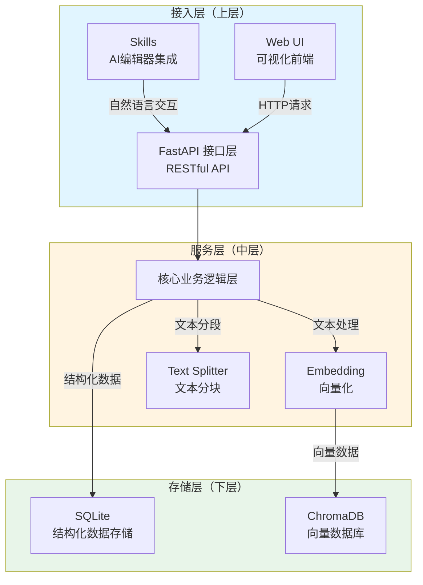
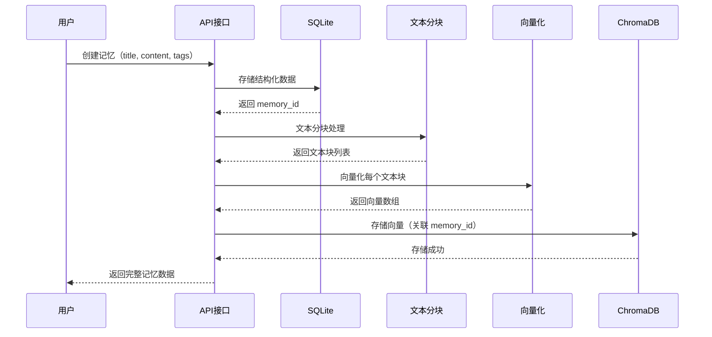
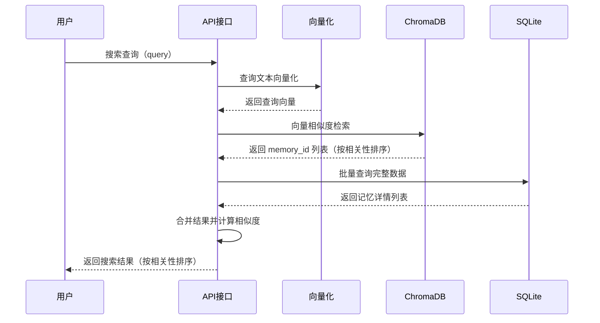

# 架构设计与实现思路

本文档详细介绍了 AI 知识记忆库（Mymom）的架构设计、数据流向以及核心实现思路。

## 项目架构

本项目采用**三层架构设计**，清晰分离接入层、服务层和存储层，实现模块化和可扩展性。

### 架构层次

**架构图说明**：
- 🔵 **接入层**：提供多种接入方式，Skills 和 Web UI 并行
- 🟡 **服务层**：统一 API 接口，核心逻辑处理
- 🟢 **存储层**：双库存储，各司其职

### 详细说明

#### 1. 接入层（上层）

**Skills（AI 编辑器集成）**
- 通过 Cursor Skills 或 Claude MCP 协议集成到 AI 编辑器
- 支持自然语言交互，AI 可自动调用知识库功能
- 实现跨会话、跨编辑器的知识复用

**Web UI（可视化前端）**
- React + JavaScript (JSX) 构建的现代化 Web 界面
- 提供记忆创建、编辑、删除、搜索等完整功能
- 支持语义搜索和全文检索两种模式切换
- 用户画像可视化（标签词云、饼图、柱状图）
- 前端构建产物集成到后端，支持单端口访问

#### 2. 服务层（中层）

**FastAPI 接口层**
- 提供 RESTful API，统一对外接口
- 处理请求验证、错误处理、CORS 配置
- 支持 Swagger 自动文档生成

**核心业务逻辑层**
- **Embedding 模块**：文本向量化，使用 BAAI/bge-small-zh-v1.5 模型
- **Text Splitter 模块**：文本分块处理（chunk_size=1000, overlap=100）
- **业务逻辑封装**：协调双库操作，保证数据一致性

#### 3. 存储层（下层）

**SQLite 数据库**
- 存储结构化数据：id、title、content、tags、created_at
- 支持全文检索（FTS），快速关键词匹配
- 轻量级、零配置、本地存储

**ChromaDB 向量数据库**
- 存储文本向量数据，支持语义搜索
- 使用余弦相似度计算，返回相关性排序结果
- 持久化存储，支持增量更新

## 数据流向

### 存储流程

### 搜索流程

## 核心算法与策略

### 搜索策略

#### 语义搜索流程
1. 查询文本向量化（使用 BAAI/bge-small-zh-v1.5）
2. ChromaDB 向量检索（top_k=10）
3. 去重处理（同一记忆的多个块只保留相关性最高的）
4. 从 SQLite 批量获取完整数据
5. 计算相似度（distance 转换为 relevance，归一化到 [0, 1]）
6. 阈值过滤（relevance >= 0.7）
7. 间隔分析（找到相关性明显下降的临界点，智能分割）
8. 按相关性排序返回

#### 全文检索流程
1. SQLite FTS 关键词匹配
2. 返回匹配的记忆列表
3. 默认 relevance=1.0（关键字匹配）

### 文本分块策略
- **块大小**: 1000 字符
- **重叠大小**: 100 字符
- **分块方式**: 按字符数切分，优先在换行符或句号处切断（保留语义完整性）

## 架构优势

- ✅ **职责清晰**：三层架构，各司其职
- ✅ **双库互补**：SQLite 提供结构化查询，ChromaDB 提供语义搜索
- ✅ **易于扩展**：接口层统一，便于添加新的接入方式
- ✅ **本地优先**：所有数据存储在本地，保护隐私
